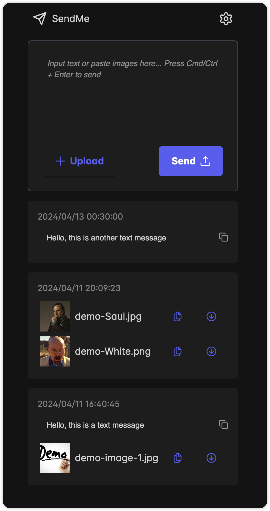

# SendMe

SendMe 是一个基于 React、Node.js 和 SQLite 的简易网络剪贴板/中转站。它允许用户发送文本消息，图片和文件，并支持通过 Docker 部署。

## 开发动机
在日常学习和工作中，经常会需要在多个设备之间拷贝一段话，传递图片或文件的需求。

而很多情况下，我遇到的主机都是没有安装微信，QQ 等即时通讯软件。

在这样的设备上，我也没有登录电子邮件或其他任何账号的权限或欲望。

于是我便花了几天时间写了这个简单的小项目，同时也是作为学习 [Full stack open](https://fullstackopen.com/en/) 项目的结课小练习。

## 功能
- 通过 Docker 部署在云服务器上
- 通过域名或 IP 访问服务，无需注册
- 可直接粘贴文字或剪贴板里的图片
- 一键复制文件或图片，无需先用鼠标选择或点击右键后复制

## 页面展示


## 技术栈
- 前端：React, Vite, PrimeReact, Quill
- 后端：Express, SQLite
- 部署：Docker, Docker Compose

## 开发

### 环境要求
- Node.js
- Docker

### 运行项目
1. 克隆项目
```shell
git clone https://github.com/insv23/SendMe.git
```

2. 安装前端依赖
```shell
cd frontend
npm install
```

3. 安装后端依赖
```shell
cd ../backend
npm install
```

4. 后端初始化开发数据库
```shell
npm run db:dev
```

5. 启动后端服务器
```shell
npm run dev
```
后端默认运行端口是 9003

6. 启动前端服务器
```shell
cd ../frontend
npm run dev
```
前端默认运行端口是 5173

### Docker 部署
构建并启动容器
```shell
docker-compose up --build
```

## 声明
包含大量 AI 辅助创作内容，包括但不限于代码、注释以及文档

## 许可证
本项目采用 ISC 许可证